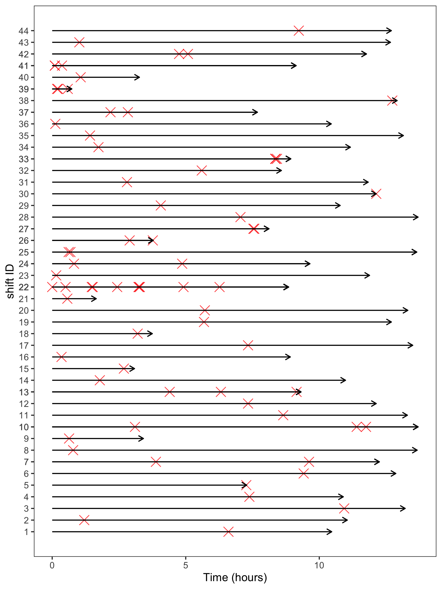

```{r setup, include=FALSE}
knitr::opts_chunk$set(echo = TRUE)
```

# Logit

```{r}
pacman::p_load(data.table, rstanarm)
agg30 = fread("data/31-analyses_30_minute_intervals.csv")
```

```{r eval=FALSE}
fitlogit = stan_glmer(SCE_binary ~ 1 + cum_drive + age + 
                        precip_intensity + precip_probability + 
                        wind_speed + visibility + 
                        speed_limit + num_lanes + interval_time + 
                        (1 + cum_drive|driver), data = as.data.frame(agg30), 
                      family = binomial(link = "logit"), 
                      QR=TRUE, chains = 4, iter = 2000)
saveRDS(fitlogit, "fit/logit_fit.rds")

broom::tidy(fitlogit, intervals = TRUE, prob = 0.5)
broom::tidy(fitlogit, parameters = "hierarchical")
broom::tidy(fitlogit, parameters = "varying")
```

# Poisson

```{r eval=FALSE}
fitpoisson = stan_glmer(n_SCE ~ 1 + cum_drive + age + 
                          precip_intensity + precip_probability + 
                        wind_speed + visibility + speed_limit + num_lanes + 
                        (1 + cum_drive|driver), 
                        offset = log(interval_time),
                      data = as.data.frame(agg30), 
                      family = "poisson", 
                      QR=TRUE, chains = 4, iter = 2000)
saveRDS(fitpoisson, "fit/poisson_fit.rds")

broom::tidy(fitpoisson, intervals = TRUE, prob = 0.5)
broom::tidy(fitpoisson, parameters = "hierarchical")
broom::tidy(fitpoisson, parameters = "varying")
```


# NHPP

## Read data

```{r}
pacman::p_load(dplyr, ggplot2, rstan, data.table, lubridate)
shif = data.table::fread("data/32-analyses_shifts.csv")
event_tab = data.table::fread("data/33-analyses_events.csv") %>% 
  .[,shift_id := as.integer(as.factor(paste0(driver, shift_ID)))]
```

## Stan estimation

```{r nhppstan, eval=FALSE}
standat = list(
  N = shif[,sum(n_SCE)],
  K = ncol(shif[,age:num_lanes]),
  S = shif[,.N],
  D = shif[,length(unique(driver))],
  id = shif[,as.integer(as.factor(driver))],
  tau = shif[,shift_length/60],
  event_time = event_tab[,time2event/60],
  group_size = shif[,n_SCE],
  X_predictors = as.matrix(shif[,age:num_lanes])
)

fit = stan("stan/nhpp_non_center.stan",
         chains = 4, iter = 2000, data = standat, 
         cores = 4, seed = 123)#, init_r = .5

saveRDS(fit, "fit/nhpp_fit_non_center.rds")
```

```{r exampletrace, fig.cap="Example trace plot for shape parameter $\\beta$ in NHPP"}
fitnhpp = readRDS("fit/nhpp_fit_non_center.rds")
tracep = rstan::traceplot(fitnhpp, "beta")
ggsave("figs/traceplot_beta.png", width = 10, height = 6.18, dpi = 300)
tracep
```


## Arrow plot

```{r}
start_end_dat = event_tab %>% 
  .[,.(start_time = 0, end_time = shift_length),
    shift_id]

p = event_tab %>% 
    ggplot(aes(x = time2event, y = shift_id)) + 
    geom_point(alpha = 0.8, shape = 4, color = 'red', size = 4) + 
    scale_y_continuous("shift ID", 
                       labels = as.character(event_tab$shift_id), 
                       breaks = event_tab$shift_id)+
    xlab('Time to event (minutes)') + 
    geom_segment(data = start_end_dat,
                 aes(x = start_time, xend = end_time, 
                     y = shift_id, yend = shift_id),
                 lineend = 'butt',
                 arrow = arrow(length = unit(0.2, "cm"))) + 
  labs(x = "Time (hours)")+
  theme_test()

ggsave("figs/t2events_arrow_plot.png", p, width = 6, height = 8, dpi = 300)
```

```{r fig.cap="Arrow plot of time of SCEs in each shift", fig.width=5, fig.height=5}

```

